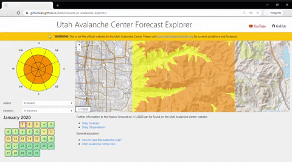

# ❄ Avalanche Forecast Explorer

## Overview
This project visualizes information present in [Utah Avalanche Center](https://utahavalanchecenter.org) website using [D3](https://d3js.org/).  
It was submitted as part of [University of Utah](https://www.cs.utah.edu/)'s Fall 2020 edition of CS 6630 Visualization for Data Science class project. 

  

## Installation
No package requirements. 
We used [Visual Studio](https://code.visualstudio.com/) as our editor along with [Live Server](https://marketplace.visualstudio.com/items?itemName=ritwickdey.LiveServer) for live reloads.

## Website
The project is hosted [here](https://github4ak.github.io/dataviscourse-pr-avalanche-explorer/).  
[Best viewed at a screen resolution of 1366x768 at 67% zoom on Chrome browser]

## Authors
* [Abishek Krishnan](https://github.com/github4ak)
* [Joachim Meyer](https://github.com/jomey)

